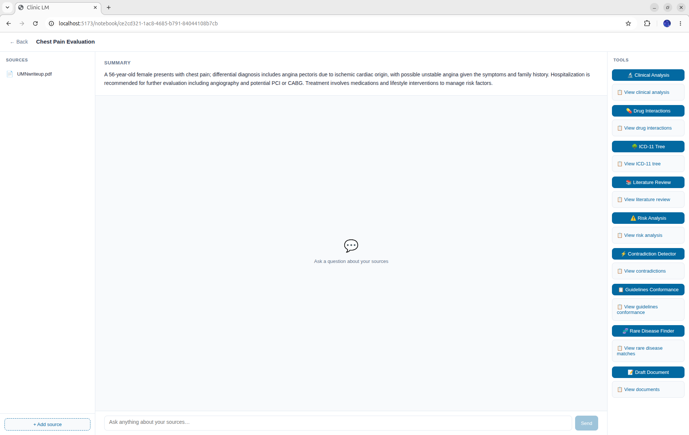

# Clinic LM

An AI-powered clinical notebook platform that helps clinicians organise patient documentation and run a suite of structured clinical analyses — differential diagnosis, drug interaction checking, ICD-11 mapping, literature review, risk scoring, rare disease matching, contradiction detection, guidelines conformance, and document drafting — all powered by a locally-running LLM (Ollama).


---

## Table of Contents

1. [Architecture Overview](#architecture-overview)
2. [Tech Stack](#tech-stack)
3. [Repository Structure](#repository-structure)
4. [Prerequisites](#prerequisites)
5. [Environment Variables](#environment-variables)
6. [Running the Project](#running-the-project)
7. [Authentication System](#authentication-system)
8. [Database Schema](#database-schema)
9. [Backend API Reference](#backend-api-reference)
10. [Clinical Analysis Services](#clinical-analysis-services)
11. [External Integrations](#external-integrations)
12. [Frontend Architecture](#frontend-architecture)
13. [Adding a New Role](#adding-a-new-role)
14. [Adding a New Analysis Tool](#adding-a-new-analysis-tool)
15. [Logging & Debugging](#logging--debugging)
16. [Known Constraints](#known-constraints)

---

## Architecture Overview

```
Browser
  │  (port 5173)
  ▼
┌──────────────────────┐
│   Vite Dev Server    │  React 18 + TypeScript
│   (frontend)         │  proxies /api → backend:8000
└──────────┬───────────┘
           │ HTTP (Docker network)
           ▼
┌──────────────────────┐
│   FastAPI Backend    │  Python 3.11, Uvicorn --reload
│   (backend:8000)     │
└───┬─────────┬────────┘
    │         │
    ▼         ▼
PostgreSQL  MongoDB       ChromaDB (embedded)   Ollama (host GPU)
(metadata)  (documents)   (notebook RAG index)  (LLM inference)
```

**Request flow for a clinical analysis:**
1. Browser sends `POST /api/notebooks/{id}/analyze` with session cookie.
2. FastAPI resolves the user via the `sessions` table in Postgres.
3. The service reads the notebook's documentation from MongoDB.
4. Keywords are extracted via a HuggingFace NER model (`d4data/biomedical-ner-all`).
5. Relevant chunks are retrieved from ChromaDB (per-notebook RAG index).
6. Structured prompts are sent to Ollama; responses are parsed with Pydantic.
7. External APIs (PubMed, RxNav, OpenFDA, …) are called in parallel where needed.
8. The result is written back to MongoDB and returned as JSON.

---

## Tech Stack

| Layer | Technology |
|---|---|
| Frontend | React 18, TypeScript 5, Vite 5, React Router 6, React Markdown, Sass |
| Backend | Python 3.11, FastAPI 0.115, Uvicorn, Pydantic v2 |
| Relational DB | PostgreSQL 16 (psycopg2, connection pool) |
| Document DB | MongoDB 7 (pymongo) |
| Vector DB | ChromaDB (embedded, on-disk at `backend/notebook_rag_db/`) |
| LLM | Ollama (`qwen2.5:7b` default, configurable) |
| NER model | `d4data/biomedical-ner-all` via HuggingFace Transformers |
| PDF parsing | LiteParse + Tesseract OCR |
| Email | Gmail SMTP via Python `smtplib` (App Password) |
| Infrastructure | Docker, Docker Compose |

---

## Repository Structure

```
clinic-lm/
├── docker-compose.yml
├── .env                        # secrets & config (never commit)
├── backend/
│   ├── Dockerfile
│   ├── requirements.txt
│   ├── main.py                 # FastAPI app, logging config, exception handler
│   ├── config.py               # env var loading
│   ├── dependencies.py         # get_current_user, require_admin FastAPI deps
│   ├── db/
│   │   ├── postgres.py         # connection pool, schema init
│   │   └── mongo.py            # singleton MongoClient
│   ├── models/
│   │   └── roles.py            # Role enum + ROLE_DEFINITIONS dict
│   ├── routers/
│   │   ├── auth.py             # /auth/* — OTP login & registration
│   │   ├── users.py            # /users/* — profile & admin management
│   │   └── notebooks.py        # /notebooks/* — CRUD + all analysis endpoints
│   ├── services/
│   │   ├── ingestion.py        # PDF → text (LiteParse/OCR), URL → text
│   │   ├── generation.py       # LLM: title, summary, documentation from sources
│   │   ├── clinical_analyzer.py
│   │   ├── interaction_checker.py
│   │   ├── icd11_tree.py
│   │   ├── literature_review.py
│   │   ├── risk_analyser.py
│   │   ├── rare_disease.py
│   │   ├── rare_disease_triangulator.py
│   │   ├── contradiction_detector.py
│   │   ├── guidelines_conformance.py
│   │   ├── document_drafter.py
│   │   ├── chat_bot.py
│   │   ├── notebook_rag.py     # per-notebook ChromaDB RAG index
│   │   ├── rag_retriever.py    # MedCPT medical RAG retriever
│   │   ├── extract_keywords.py # biomedical NER keyword extraction
│   │   ├── anonymizer.py       # PHI/PII de-identification via LLM
│   │   └── data_model.py       # all Pydantic models for LLM I/O
│   ├── external/
│   │   ├── pubmed.py           # PubMed E-utilities client
│   │   ├── rxnav.py            # RxNorm/RxNav drug interaction API
│   │   ├── openfda.py          # OpenFDA drug labels & adverse events
│   │   ├── icd11.py            # WHO ICD-11 API (OAuth2)
│   │   ├── orphadata.py        # Orphanet rare disease / HPO data
│   │   ├── nlm_clinical.py     # NLM clinical guidelines API
│   │   └── internet.py         # DuckDuckGo search fallback
│   └── utils/
│       └── email.py            # send_email() via Gmail SMTP
└── frontend/
    ├── Dockerfile
    ├── vite.config.ts          # dev server + /api proxy
    ├── src/
    │   ├── main.tsx
    │   ├── App.tsx             # routing, auth gate
    │   ├── index.scss          # global styles, design tokens
    │   ├── types.ts            # all TypeScript interfaces
    │   ├── context/
    │   │   └── UserContext.tsx # user state, logout, refresh
    │   ├── pages/
    │   │   ├── AuthPage.tsx    # email → (name) → OTP flow
    │   │   ├── NotebooksPage.tsx
    │   │   ├── NotebookPage.tsx
    │   │   └── UsersPage.tsx   # admin-only user management
    │   └── components/
    │       ├── SourcesPanel.tsx
    │       ├── ChatPanel.tsx
    │       ├── ToolsPanel.tsx
    │       ├── AddSourceModal.tsx
    │       ├── ClinicalAnalysisModal.tsx
    │       ├── DrugInteractionModal.tsx
    │       ├── ICD11Modal.tsx
    │       ├── LiteratureReviewModal.tsx
    │       ├── RiskAnalysisModal.tsx
    │       ├── RareDiseaseModal.tsx
    │       ├── ContradictionDetectorModal.tsx
    │       ├── GuidelinesConformanceModal.tsx
    │       ├── DocumentDrafterModal.tsx
    │       └── ConfidenceBar.tsx
```

---

## Prerequisites

| Requirement | Notes |
|---|---|
| Docker + Docker Compose | Tested with Compose v2 |
| Ollama | Running on the **host machine** (not inside Docker). Install from [ollama.ai](https://ollama.ai) |
| Ollama model | `ollama pull qwen2.5:7b` — or set `OLLAMA_MODEL` to any supported model |
| Gmail App Password | Required for OTP email. Generate at Google Account → Security → 2-Step Verification → App Passwords. **Do not use your real password.** |

> **GPU note:** The NER model (`d4data/biomedical-ner-all`) and the Notebook RAG index both benefit from a CUDA GPU. The Dockerfile is based on `pytorch/pytorch:2.4.0-cuda12.4-cudnn9-runtime`. To enable GPU passthrough, uncomment the `deploy.resources` section for the `backend` service in `docker-compose.yml`.

---

## Environment Variables

A template with all required variables and instructions is provided at [`.env.example`](.env.example).

```bash
cp .env.example .env
# then fill in your values
```

`.env` is listed in `.gitignore` and must never be committed. All variables are loaded by `backend/config.py` via `python-dotenv`.

---

## Running the Project

### Start everything

```bash
docker compose up --build
```

The first boot downloads model weights for `d4data/biomedical-ner-all` and `MedCPT` (~2–4 GB). Subsequent boots use the Docker layer cache.

| Service | URL |
|---|---|
| Frontend | http://localhost:5173 |
| Backend API | http://localhost:8000 |
| API docs (Swagger) | http://localhost:8000/docs |

### Stop

```bash
docker compose down
```

### Rebuild a single service

```bash
docker compose up --build backend
```

### View logs

```bash
docker logs -f clinic-lm-backend-1
docker logs -f clinic-lm-frontend-1
```

### First admin user

After registering your account through the UI, promote it to admin via psql:

```bash
docker exec -it clinic-lm-postgres-1 psql -U clinic_user -d clinic_db
```

```sql
UPDATE users SET role_id = 3 WHERE email = 'your@email.com';
```

---

## Authentication System

Authentication uses **passwordless OTP via email**. There are no passwords stored in the database.

### Flow

```
1. User enters email
       │
       ▼
   POST /auth/request-otp
       │
       ├─ email exists? ──YES──▶ send OTP ──▶ return { status: "otp_sent" }
       │
       └─ NO ──▶ return { status: "registration_required" }
                     │
                     ▼ (frontend shows name input)
               POST /auth/register  { email, name }
                     │
                     ▼ create user (role=Free), send OTP
                     ▼ return { status: "otp_sent" }

2. User enters 6-digit OTP
       │
       ▼
   POST /auth/verify-otp  { email, otp }
       │
       ▼ validates OTP (10-min expiry, single-use)
       ▼ creates 30-day session
       ▼ sets httponly session_id cookie
       ▼ returns { user_id, name, email, role_id }
```

### Session cookie

The `session_id` cookie is:
- `httponly` — not accessible to JavaScript
- `samesite=lax` — CSRF protection
- 30-day expiry (rolling on next login)

### FastAPI auth dependencies

Two reusable dependencies are in `backend/dependencies.py`:

```python
# Resolves session → user dict. Raises 401 if not authenticated.
user = Depends(get_current_user)

# Same as above, additionally raises 403 if user is not Admin.
admin = Depends(require_admin)
```

Use them on any new endpoint:

```python
@router.get("/protected")
def my_endpoint(user: dict = Depends(get_current_user)):
    return {"hello": user["name"]}
```

---

## Database Schema

### PostgreSQL (relational metadata)

```sql
roles
  role_id  INT PRIMARY KEY   -- 1=Free, 2=Premium, 3=Admin
  name     TEXT              -- "free" | "premium" | "admin"
  label    TEXT              -- "Free User" | ...

users
  user_id     UUID PRIMARY KEY
  name        TEXT
  email       TEXT UNIQUE (partial index, nullable for legacy rows)
  role_id     INT → roles.role_id  DEFAULT 1
  is_verified BOOLEAN              DEFAULT false
  created_at  TIMESTAMPTZ          DEFAULT now()

otps
  otp_id     UUID PRIMARY KEY  DEFAULT gen_random_uuid()
  email      TEXT
  otp_code   TEXT              -- 6-digit numeric string
  expires_at TIMESTAMPTZ       -- now() + 10 minutes
  used       BOOLEAN           DEFAULT false
  created_at TIMESTAMPTZ       DEFAULT now()

sessions
  session_id UUID PRIMARY KEY  DEFAULT gen_random_uuid()
  user_id    UUID → users.user_id  ON DELETE CASCADE
  created_at TIMESTAMPTZ
  expires_at TIMESTAMPTZ       -- now() + 30 days

notebooks
  notebook_id   UUID PRIMARY KEY
  user_id       UUID → users.user_id
  title         TEXT
  source_titles TEXT[]
  updated_at    TIMESTAMPTZ
```

The schema is created/migrated automatically on startup via `db/postgres.py:init_schema()`. New columns are added with `ADD COLUMN IF NOT EXISTS` so it is safe to run against an existing database.

### MongoDB (document store)

Collection: `notebook_content`

```json
{
  "notebook_id": "uuid",
  "user_id": "uuid",
  "sources": [
    { "id": "uuid", "type": "pdf|url|text", "name": "...", "content": "..." }
  ],
  "documentation": "full markdown documentation generated from sources",
  "summary": "short plain-text summary",
  "clinical_analysis": { ... },
  "drug_interactions": { ... },
  "icd11": { ... },
  "literature": { ... },
  "risk": { ... },
  "rare_diseases": { ... },
  "contradictions": { ... },
  "guidelines": { ... },
  "drafts": { ... },
  "chat_history": [ { "role": "user|assistant", "content": "..." } ],
  "updated_at": "ISODate"
}
```

Analysis results are stored back on the document after each run. Re-running an analysis overwrites the previous result.

### ChromaDB (vector store)

Stored on disk at `backend/notebook_rag_db/`. One ChromaDB collection per notebook, keyed by `notebook_id`. Populated when sources are added (background task). Used by all analysis services for RAG retrieval. Deleted when a notebook is deleted.

---

## Backend API Reference

### Auth — `/auth`

| Method | Path | Body | Description |
|---|---|---|---|
| POST | `/auth/request-otp` | `{ email }` | Check email, send OTP if registered |
| POST | `/auth/register` | `{ email, name }` | Register new user, send OTP |
| POST | `/auth/verify-otp` | `{ email, otp }` | Verify OTP, set session cookie |
| POST | `/auth/logout` | — | Clear session cookie |

### Users — `/users`

| Method | Path | Auth | Description |
|---|---|---|---|
| GET | `/users/me` | Any | Current user's profile |
| GET | `/users/roles` | Any | List of all roles |
| GET | `/users` | Admin | List all registered users |
| PATCH | `/users/{user_id}` | Admin | Update name or role |
| DELETE | `/users/{user_id}` | Admin | Delete a user |

### Notebooks — `/notebooks`

| Method | Path | Description |
|---|---|---|
| GET | `/notebooks` | List user's notebooks |
| POST | `/notebooks` | Create a new notebook |
| GET | `/notebooks/{id}` | Get notebook detail + sources |
| DELETE | `/notebooks/{id}` | Delete notebook and all data |
| POST | `/notebooks/{id}/sources` | Add sources (PDF, URL, or text) |

### Analysis — all under `/notebooks/{id}/...`

| Method | Path | Description |
|---|---|---|
| POST | `.../analyze` | Run clinical analysis (differential diagnosis) |
| GET | `.../analysis` | Fetch last clinical analysis result |
| POST | `.../interactions` | Run drug interaction check |
| GET | `.../interactions` | Fetch last interaction result |
| POST | `.../icd11` | Run ICD-11 code mapping |
| GET | `.../icd11` | Fetch last ICD-11 result |
| POST | `.../literature` | Run literature review |
| GET | `.../literature` | Fetch last literature review result |
| POST | `.../risk` | Run risk score analysis |
| GET | `.../risk` | Fetch last risk analysis result |
| POST | `.../rare-diseases` | Run rare disease matching |
| GET | `.../rare-diseases` | Fetch last rare disease result |
| POST | `.../contradictions` | Run contradiction detection |
| GET | `.../contradictions` | Fetch last contradiction result |
| POST | `.../guidelines` | Run guidelines conformance check |
| GET | `.../guidelines` | Fetch last guidelines result |
| POST | `.../draft` | Generate document drafts |
| GET | `.../draft` | Fetch last draft result |
| GET | `.../chat` | Load persisted chat history |
| POST | `.../chat` | Send message (SSE streaming response) |
| POST | `.../chat/history` | Save chat history |

All analysis endpoints require the notebook to have documentation (i.e. at least one source must have been added).

---

## Clinical Analysis Services

All services in `backend/services/` follow the same pattern:
1. Load documentation from MongoDB (already passed in from the router).
2. Extract medical keywords using the NER model (`ExtractKeywords`).
3. Retrieve relevant chunks from the per-notebook RAG index (`NotebookRAG`).
4. Build a structured prompt and call Ollama with a Pydantic response model.
5. Call external APIs in parallel threads (`concurrent.futures.ThreadPoolExecutor`).
6. Merge and return results.

### `clinical_analyzer.py` — Differential Diagnosis

Produces a ranked differential diagnosis with:
- Bayesian posterior likelihood per condition
- ICD-11 codes
- Supporting and refuting evidence (sourced by type and ID)
- Red flags requiring urgent action
- Recommended diagnostic tests with priority (stat/urgent/routine)
- Next best discriminating question/test

Uses: NER, notebook RAG, PubMed, MedCPT RAG retriever, Ollama structured output.

### `interaction_checker.py` — Drug Interaction Checker

Multi-step pipeline:
1. LLM extracts drug names and normalises to generic names.
2. RxNav resolves RxCUI identifiers.
3. RxNav interaction API checks each pair.
4. OpenFDA pulls boxed warnings and adverse events.
5. LLM generates a PICO summary per interaction with supporting PubMed abstracts.

### `icd11_tree.py` — ICD-11 Mapping

Searches the WHO ICD-11 API for each extracted keyword. Builds a tree of parent/child ICD-11 nodes. Returns codes with browser links and ancestor chains.

### `literature_review.py` — Evidence-Based Literature Review

1. LLM formulates a PubMed search query (primary + fallback).
2. PubMed returns abstracts.
3. LLM grades each article (A–D) with study type, bias flags, evidence level, and summary.

### `risk_analyser.py` — Clinical Risk Scores

Runs four validated scoring tools in parallel threads:
- **Wells DVT** — deep vein thrombosis probability
- **CHA₂DS₂-VASc** — stroke risk in atrial fibrillation
- **qSOFA** — quick sepsis-related organ failure assessment
- **MELD/MELD-Na** — liver disease severity

Each score uses the NER + notebook RAG to extract the required parameters, then applies the scoring algorithm deterministically. Missing parameters are reported explicitly.

### `rare_disease.py` — Rare Disease Finder

1. LLM extracts symptoms from documentation.
2. Symptoms are mapped to HPO (Human Phenotype Ontology) IDs via Orphadata.
3. Orphadata returns diseases matching the HPO set with match scores.
4. Results are triangulated and ranked by match score.

### `contradiction_detector.py` — Contradiction Detection

Detects two types of contradictions:
- **Intra-document**: conflicting claims within a single source.
- **Source-vs-source**: conflicting claims across different uploaded sources.

Each contradiction is classified by severity (high/medium/low) with an explanation and suggested resolution.

### `guidelines_conformance.py` — Clinical Guidelines Check

1. LLM extracts keywords for guideline search.
2. NLM clinical guidelines API and PubMed Bookshelf are queried.
3. LLM compares the patient's documented management against retrieved guidelines.
4. Each finding is classified as conforming / deviation / partial / not assessed.

### `document_drafter.py` — Document Drafting

Generates three document types in parallel:
- **Referral letter** — to a specialist
- **Discharge summary** — structured hospital discharge document
- **Case write-up** — academic/teaching case presentation

### `chat_bot.py` — AI Chat (Streaming)

Maintains conversation context. Responds to freeform questions about the notebook content using the documentation as context. Responses are streamed via SSE (Server-Sent Events).

### `anonymizer.py` — PHI De-identification

Replaces PII/PHI with `[PLACEHOLDER]` tokens before storing source content (when the user enables anonymisation on upload). Uses Ollama with strict system prompt to preserve all clinical content while replacing only identifiers (names, dates, addresses, MRNs, etc.).

### `notebook_rag.py` — Per-Notebook RAG Index

Each notebook has its own ChromaDB collection. When sources are added:
- Text is chunked (800 chars, 100 overlap).
- Chunks are embedded using a HuggingFace transformer model.
- Embeddings are stored in ChromaDB on disk.

Used by analysis services to retrieve the most relevant chunks for any given query.

### `extract_keywords.py` — Biomedical NER

Runs the `d4data/biomedical-ner-all` model (loaded once at startup). Chunks input text to stay within model token limits and returns a deduplicated set of clinical entities (diseases, drugs, procedures, anatomy, etc.).

---

## External Integrations

All clients live in `backend/external/`.

| Module | API | Auth | Used by |
|---|---|---|---|
| `pubmed.py` | NCBI E-utilities | `BIO_EMAIL` (Entrez email) | ClinicalAnalyzer, LiteratureReview, InteractionChecker |
| `rxnav.py` | NLM RxNorm / RxNav | None (public) | InteractionChecker |
| `openfda.py` | OpenFDA | None (public) | InteractionChecker |
| `icd11.py` | WHO ICD-11 API | OAuth2 client credentials (`ICD11_CLIENT_ID`, `ICD11_CLIENT_SECRET`) | ICD11TreeService |
| `orphadata.py` | Orphanet HPO data | None (bundled data) | RareDiseaseService |
| `nlm_clinical.py` | NLM clinical guidelines | None (public) | GuidelinesConformance |
| `internet.py` | DuckDuckGo | None (public) | InteractionChecker fallback |

---

## Frontend Architecture

### Routing and Auth Gate

`App.tsx` renders `<AppRoutes>` inside `<UserProvider>` and `<BrowserRouter>`. `AppRoutes` checks the context:

```
loading  →  spinner
!user    →  <AuthPage />  (replaces entire app)
user     →  <Routes>  (normal app)
```

The `/users` route is only registered when `user.role_id === 3` (Admin).

### UserContext

`context/UserContext.tsx` exposes:

```typescript
const { user, loading, logout, refresh } = useCurrentUser()
```

- `user` — full `User` object (`user_id`, `name`, `email`, `role_id`) or `null`
- `loading` — true during initial session check
- `logout()` — calls `POST /api/auth/logout`, clears user state
- `refresh()` — re-fetches `/api/users/me`, use after OTP verification

### API Proxy

Vite's dev server proxies every `/api/*` request to `http://backend:8000` (stripping the `/api` prefix). This means all `fetch` calls in the frontend use `/api/...` paths. In production you would configure nginx or a similar reverse proxy to do the same.

### Streaming Chat

`ChatPanel.tsx` opens a `fetch` to `POST /api/notebooks/{id}/chat` and reads the response as a `ReadableStream`. Each SSE chunk is a text token appended to the in-progress assistant bubble. When the stream closes the message is committed to history.

### Roles

Roles are defined as a const map in `types.ts` (mirroring the backend `ROLE_DEFINITIONS`):

```typescript
export const ROLES = {
  1: { id: 1, name: 'free',    label: 'Free User'    },
  2: { id: 2, name: 'premium', label: 'Premium User' },
  3: { id: 3, name: 'admin',   label: 'Admin User'   },
} as const
```

---

## Adding a New Role

Roles are intentionally centralised to make expansion easy.

**Backend — `backend/models/roles.py`:**

```python
class Role(IntEnum):
    FREE    = 1
    PREMIUM = 2
    ADMIN   = 3
    CLINIC  = 4   # ← add here

ROLE_DEFINITIONS: dict[int, dict] = {
    ...
    Role.CLINIC: {"id": 4, "name": "clinic", "label": "Clinic User"},
}
```

**Database** — the `roles` table is seeded in `init_schema()` via `INSERT ... ON CONFLICT DO NOTHING`. Add the new row there too:

```python
cur.execute("""
    INSERT INTO roles (role_id, name, label) VALUES
        (1, 'free',    'Free User'),
        (2, 'premium', 'Premium User'),
        (3, 'admin',   'Admin User'),
        (4, 'clinic',  'Clinic User')   -- ← add
    ON CONFLICT DO NOTHING
""")
```

**Frontend — `frontend/src/types.ts`:**

```typescript
export const ROLES = {
  ...
  4: { id: 4, name: 'clinic', label: 'Clinic User' },
} as const
```

Also add a CSS class in `index.scss`:
```scss
&--clinic { background: #dcfce7; color: #166534; }
```

---

## Adding a New Analysis Tool

Follow this pattern to add a new analysis service end-to-end.

### 1. Pydantic models — `backend/services/data_model.py`

```python
class MyToolResult(BaseModel):
    findings: list[str]
    confidence: float = _CONF_FIELD
```

### 2. Service — `backend/services/my_tool.py`

```python
import ollama
from config import OLLAMA_BASE_URL, OLLAMA_MODEL
from services.data_model import MyToolResult
from services.notebook_rag import NotebookRAG

class MyTool:
    def analyze(self, notebook_id: str, documentation: str) -> dict:
        chunks = NotebookRAG.query(notebook_id, "relevant query", n_results=5)
        context = "\n\n".join(c["content"] for c in chunks)

        response = ollama.chat(
            model=OLLAMA_MODEL,
            host=OLLAMA_BASE_URL,
            messages=[{"role": "user", "content": f"{context}\n\n{documentation}"}],
            format=MyToolResult.model_json_schema(),
        )
        parsed = MyToolResult.model_validate_json(response.message.content)
        return parsed.model_dump()
```

### 3. Router endpoints — `backend/routers/notebooks.py`

```python
@router.post("/{notebook_id}/my-tool")
def run_my_tool(notebook_id: str, request: Request):
    uid = _user_id(request)
    doc = get_db().notebook_content.find_one({"notebook_id": notebook_id, "user_id": uid})
    if not doc:
        return JSONResponse(status_code=404, content={"error": "Not found"})

    documentation = doc.get("documentation") or ""
    if not documentation:
        return JSONResponse(status_code=400, content={"error": "No documentation yet"})

    from services.my_tool import MyTool
    result = MyTool().analyze(notebook_id, documentation)

    get_db().notebook_content.update_one(
        {"notebook_id": notebook_id},
        {"$set": {"my_tool": result, "updated_at": _now()}},
    )
    return result


@router.get("/{notebook_id}/my-tool")
def get_my_tool(notebook_id: str, request: Request):
    uid = _user_id(request)
    doc = get_db().notebook_content.find_one({"notebook_id": notebook_id, "user_id": uid})
    if not doc or "my_tool" not in doc:
        return JSONResponse(status_code=404, content={"error": "No result yet"})
    return doc["my_tool"]
```

### 4. Frontend types — `frontend/src/types.ts`

```typescript
export interface MyToolResult {
  findings: string[]
  confidence: number
}
```

### 5. Frontend modal — `frontend/src/components/MyToolModal.tsx`

Use any existing modal (e.g. `RiskAnalysisModal.tsx`) as a template.

### 6. Wire up in `ToolsPanel.tsx` and `NotebookPage.tsx`

Add a button in `ToolsPanel` and the state/handler in `NotebookPage`.

---

## Logging & Debugging

Logging is configured in `main.py` via `logging.basicConfig(force=True, stream=sys.stderr)`. All application loggers (`routers.auth`, `services.clinical_analyzer`, etc.) use the standard `logging.getLogger(__name__)` pattern and inherit the root config.

Every unhandled exception is caught by the global `@app.exception_handler(Exception)` which logs a full traceback and returns `{ "error": "Internal server error" }` to the client.

**View live logs:**
```bash
docker logs -f clinic-lm-backend-1
```

**Common log events:**

```
INFO     routers.auth: OTP requested for user@example.com
INFO     routers.auth: Sending OTP to user@example.com
ERROR    routers.auth: Failed to send OTP to user@example.com
Traceback: smtplib.SMTPAuthenticationError ...

INFO     routers.auth: Session created for user <uuid> (user@example.com)
INFO     uvicorn.access: POST /auth/verify-otp 200
```

**`PYTHONUNBUFFERED=1`** is set in the Dockerfile to ensure Python does not buffer log output inside the container — without it, logs sit in memory and never appear in `docker logs`.

---

## Known Constraints

- **No horizontal scaling** — ChromaDB is embedded on disk and the PostgreSQL connection pool is per-process. Both would need replacing (e.g. Qdrant for vectors, pgBouncer for connections) before running multiple backend replicas.
- **Ollama must run on the host** — LLM inference is not containerised. The backend reaches it via `host.docker.internal`. GPU is recommended; CPU inference with `qwen2.5:7b` is slow (~30–60 s per analysis call).
- **NER model loads at startup** — `d4data/biomedical-ner-all` is loaded into memory on first request if a GPU is available; if not, it falls back gracefully with a warning and keyword extraction is disabled.
- **OTP rate limiting is not implemented** — there is no cap on how many OTPs a user can request. Add middleware or a Redis-backed counter before exposing to the public internet.
- **Sessions are not invalidated on logout** — `POST /auth/logout` clears the browser cookie but does not delete the session row from the database. To force invalidation, add `DELETE FROM sessions WHERE session_id = $1` in the logout handler.
- **All analysis results are overwritten on re-run** — there is no history of previous analyses. If you need audit trails, store results in an array instead of replacing the top-level key in MongoDB.
